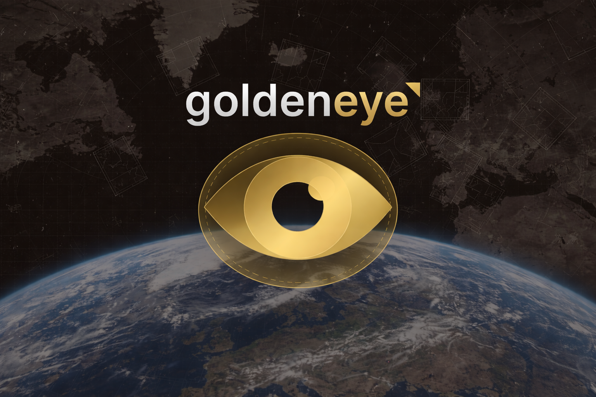
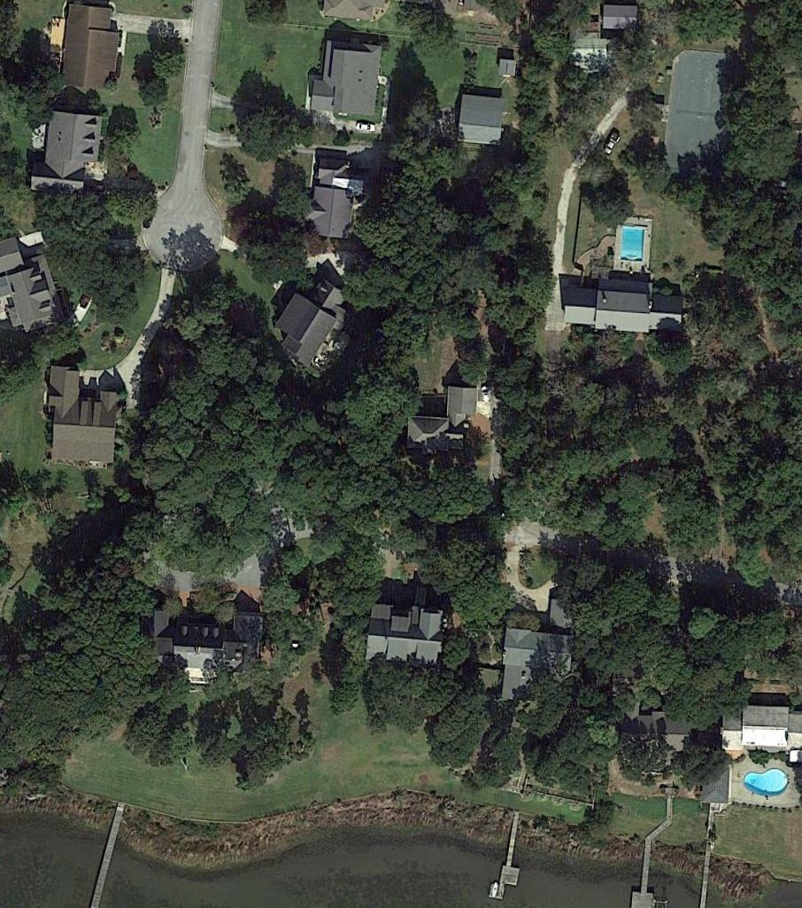

<p align="center">
  
</p>

[](https://badge.fury.io/py/goldeneye)
[](https://www.python.org/downloads/)
[](https://opensource.org/licenses/MIT)

`goldeneye` is a simple and growing unified interface for geospatial vision-language models. Run any supported geospatial VLM with just a few lines of code.

## Installation

```bash
pip install goldeneye
```

## Quick Start

```python
import goldeneye

# List available agents (models)
print(goldeneye.assets())

# Dispatch an agent for collecting intel
model = goldeneye.dispatch_agent("DescribeEarth")
report = model.recon("assets/sample.jpg", "Describe this image.")
print(report)

# Report(
#    image='assets/sample.jpg',
#
#    prompt='Describe this image.',
#
#    response='The image depicts an aerial view of a
#    residential area surrounded by dense greenery,
#    likely trees and shrubs. The houses are
#    scattered across the landscape, with varying
#    sizes and designs, some featuring pitched roofs
#    and others flat-roofed structures. The roads
#    are visible as light-colored lines
#    crisscrossing the area, connecting'
# )
```

<p align="center">
  
</p>

## Supported Models

<details open>
<summary>Click to expand model list (7 models)</summary>

| Model                   | Size | Paper                                                                                                                                | Code                                                      |
| ----------------------- | ---- | ------------------------------------------------------------------------------------------------------------------------------------ | --------------------------------------------------------- |
| **DescribeEarth**       | 3B   | [DescribeEarth: A Global Vision-Language Dataset for Aerial and Satellite Image Captioning](https://arxiv.org/abs/2509.25654v1)      | [github](https://github.com/earth-insights/DescribeEarth) |
| **ZoomEarth**           | 3B   | [ZoomEarth: A Unified Remote Sensing Framework for Multi-scale Vision-Language Tasks](https://arxiv.org/abs/2511.12267)              | [github](https://github.com/earth-insights/ZoomEarth)     |
| **EarthDial**           | 4B   | [EarthDial: Turning Multi-sensory Earth Observations to Interactive Dialogues](https://arxiv.org/abs/2501.10724)                     | [github](https://github.com/akshaydudhane16/EarthDial)    |
| **GeoChat**             | 7B   | [GeoChat: Grounded Large Vision-Language Model for Remote Sensing](https://arxiv.org/abs/2311.15826)                                 | [github](https://github.com/mbzuai-oryx/GeoChat)          |
| **GeoLLaVA-8K**         | 7B   | [GeoLLaVA-8K: A Large Vision-Language Model for High-Resolution Remote Sensing Applications](https://arxiv.org/abs/2505.21375)       | [github](https://github.com/MiliLab/GeoLLaVA-8K)          |
| **GeoZero**             | 8B   | [GeoZero: Zero-shot Geospatial Reasoning with Multimodal LLMs](https://arxiv.org/abs/2511.22645)                                     | [github](https://github.com/MiliLab/GeoZero)              |
| **Geo-R1 (8 variants)** | 3B   | [Geo-R1: Unleashing the Power of Reinforcement Learning in Generalist Geospatial Foundation Model](https://arxiv.org/abs/2510.00072) | [github](https://github.com/om-ai-lab/Geo-R1)             |

</details>

### Memory Requirements

- **3B models** (GeoR1, ZoomEarth, DescribeEarth): ~6GB VRAM at fp16
- **4B models** (EarthDial): ~8GB VRAM at fp16
- **7B models** (GeoChat, GeoLLaVA): ~14GB VRAM at fp16
- **8B models** (GeoZero): ~16GB VRAM at fp16

## Usage

```python
import torch
import goldeneye
from PIL import Image
from transformers import BitsAndBytesConfig

# Load a model (auto-detects device)
model = goldeneye.dispatch_agent("DescribeEarth")

# Or specify device/dtype
model = goldeneye.dispatch_agent("DescribeEarth", device="cuda", dtype=torch.bfloat16)

# Or use quantization for larger models
config = BitsAndBytesConfig(load_in_8bit=True)
model = goldeneye.dispatch_agent("GeoChat", quantization_config=config)

# Run inference with file path or PIL Image
report = model.recon("satellite_image.jpg", "Describe this image.")
report = model.recon(Image.open("satellite_image.jpg"), "Describe this image.", max_new_tokens=256)
```

### Benchmark Datasets

<details open>
<summary>Click to expand dataset list (24 datasets)</summary>

#### Benchmarks & Evaluation

| Dataset             | Samples | Paper                                                                  | HuggingFace                                                                                |
| ------------------- | ------- | ---------------------------------------------------------------------- | ------------------------------------------------------------------------------------------ |
| **DE-Dataset**      | 261K    | [DescribeEarth](https://arxiv.org/abs/2509.25654v1)                    | [earth-insights/DE-Dataset](https://huggingface.co/datasets/earth-insights/DE-Dataset)     |
| **XLRS-Bench-lite** | ~2.8K   | [XLRS-Bench](https://arxiv.org/abs/2503.23771)                         | [initiacms/XLRS-Bench-lite](https://huggingface.co/datasets/initiacms/XLRS-Bench-lite)     |
| **GeoChat-Bench**   | varies  | [GeoChat](https://arxiv.org/abs/2311.15826)                            | [MBZUAI/GeoChat-Bench](https://huggingface.co/datasets/MBZUAI/GeoChat-Bench)               |
| **GeoZero Eval**    | 26K     | [GeoZero](https://arxiv.org/abs/2511.22645)                            | [hjvsl/GeoZero_Eval_Datasets](https://huggingface.co/datasets/hjvsl/GeoZero_Eval_Datasets) |
| **XHRBench**        | 1.9K    | [XHRBench](https://arxiv.org/abs/2505.21375) (4K-300MP images)         | [FelixKAI/XHRBench](https://huggingface.co/datasets/FelixKAI/XHRBench)                     |
| **UAVBench**        | 966K    | [UAVIT-1M](https://arxiv.org/abs/2505.21375) (43 test units, 10 tasks) | [ZhanYang-nwpu/UAVBench](https://huggingface.co/datasets/ZhanYang-nwpu/UAVBench)           |

#### Image Captioning

| Dataset             | Samples | Paper                                                          | HuggingFace                                                                                                  |
| ------------------- | ------- | -------------------------------------------------------------- | ------------------------------------------------------------------------------------------------------------ |
| **RSICD**           | 10.9K   | [RSICD](https://arxiv.org/abs/1712.07835) (5 captions/image)   | [arampacha/rsicd](https://huggingface.co/datasets/arampacha/rsicd)                                           |
| **UCM-Captions**    | 10.5K   | [UCM-Captions](https://arxiv.org/abs/1712.07835)               | [cpratikaki/UCMcaptions_finetuning](https://huggingface.co/datasets/cpratikaki/UCMcaptions_finetuning)       |
| **Sydney-Captions** | 613     | [Sydney-Captions](https://arxiv.org/abs/1712.07835)            | [isaaccorley/Sydney-Captions](https://huggingface.co/datasets/isaaccorley/Sydney-Captions)                   |
| **NWPU-Captions**   | 31.5K   | [NWPU-Captions](https://arxiv.org/abs/2012.12345) (webdataset) | [KhangTruong/NWPU-Caption](https://huggingface.co/datasets/KhangTruong/NWPU-Caption)                         |
| **FAIR1M Caption**  | 22K     | [FAIR1M](https://arxiv.org/abs/2103.05569)                     | [blanchon/FAIR1M_Small_Caption](https://huggingface.co/datasets/blanchon/FAIR1M_Small_Caption)               |
| **RSCID-Captions**  | varies  | RSCID                                                          | [mthandazo/rscid_captions_vqa_dataset](https://huggingface.co/datasets/mthandazo/rscid_captions_vqa_dataset) |

#### Visual Question Answering (VQA)

| Dataset      | Samples | Paper                                                             | HuggingFace                                                                                                |
| ------------ | ------- | ----------------------------------------------------------------- | ---------------------------------------------------------------------------------------------------------- |
| **RS-VQA**   | 17K     | [RS-VQA](https://arxiv.org/abs/2003.07333)                        | [WaltonFuture/remote-sensing-VQA](https://huggingface.co/datasets/WaltonFuture/remote-sensing-VQA)         |
| **RSVQA-HR** | 358K    | [RSVQA](https://arxiv.org/abs/2003.07333) (Qwen format)           | [cpratikaki/RSVQA-HR_qwen_finetuning](https://huggingface.co/datasets/cpratikaki/RSVQA-HR_qwen_finetuning) |
| **VRSBench** | 29.6K   | [VRSBench](https://arxiv.org/abs/2406.12345) (123K QA pairs)      | [xiang709/VRSBench](https://huggingface.co/datasets/xiang709/VRSBench)                                     |
| **LRS-VQA**  | 7.3K    | [LRS-VQA](https://arxiv.org/abs/2406.12345) (1K-27K pixel images) | [ll-13/LRS-VQA](https://huggingface.co/datasets/ll-13/LRS-VQA)                                             |
| **LRS-GRO**  | varies  | LRS-GRO (VQA + grounding)                                         | [HappyBug/LRS-GRO](https://huggingface.co/datasets/HappyBug/LRS-GRO)                                       |

#### Instruction Tuning

| Dataset                    | Samples | Paper                                                                | HuggingFace                                                                                                                |
| -------------------------- | ------- | -------------------------------------------------------------------- | -------------------------------------------------------------------------------------------------------------------------- |
| **GeoChat Instruct**       | 318K    | [GeoChat](https://arxiv.org/abs/2311.15826)                          | [MBZUAI/GeoChat_Instruct](https://huggingface.co/datasets/MBZUAI/GeoChat_Instruct)                                         |
| **RS Visual Instructions** | 36.4K   | [AdaptLLM](https://arxiv.org/abs/2309.12345)                         | [AdaptLLM/remote-sensing-visual-instructions](https://huggingface.co/datasets/AdaptLLM/remote-sensing-visual-instructions) |
| **UAVIT-1M**               | 1.24M   | [UAVIT-1M](https://arxiv.org/abs/2505.21375) (789K images, 11 tasks) | [ZhanYang-nwpu/UAVIT-1M](https://huggingface.co/datasets/ZhanYang-nwpu/UAVIT-1M)                                           |
| **GeoPixInstruct**         | 58K     | GeoPixInstruct (pixel-level, 6 splits)                               | [Norman-ou/GeoPixInstruct-Anno](https://huggingface.co/datasets/Norman-ou/GeoPixInstruct-Anno)                             |

#### Disaster Assessment

| Dataset        | Samples | Paper                                                                                 | HuggingFace                                                                                |
| -------------- | ------- | ------------------------------------------------------------------------------------- | ------------------------------------------------------------------------------------------ |
| **DisasterM3** | 27K     | [DisasterM3](https://arxiv.org/abs/2505.12345) (123K instructions, 10 disaster types) | [Kingdrone-Junjue/DisasterM3](https://huggingface.co/datasets/Kingdrone-Junjue/DisasterM3) |

#### Large-Scale Pre-training

| Dataset        | Samples | Paper                                                 | HuggingFace                                                            |
| -------------- | ------- | ----------------------------------------------------- | ---------------------------------------------------------------------- |
| **RS5M**       | 7.25M   | [RS5M](https://arxiv.org/abs/2306.11300) (CLIP-style) | [omlab/RS5M](https://huggingface.co/datasets/omlab/RS5M)               |
| **VHM VersaD** | 4.1M    | [VHM](https://arxiv.org/abs/2406.12345)               | [FitzPC/VHM_VersaD](https://huggingface.co/datasets/FitzPC/VHM_VersaD) |

</details>

```python
from goldeneye.datasets import load_rsicd, load_geochat_instruct

# Load dataset to memory
dataset = load_rsicd(split="train")

# Or stream large datasets (recommended for RS5M, VHM VersaD, etc.)
dataset = load_geochat_instruct(split="train", streaming=True)
for sample in dataset:
    report = model.recon(sample["image"], "Describe this satellite image.")
    break
```

## Contributing

See [CONTRIBUTING.md](.github/CONTRIBUTING.md) for development setup and guidelines.
